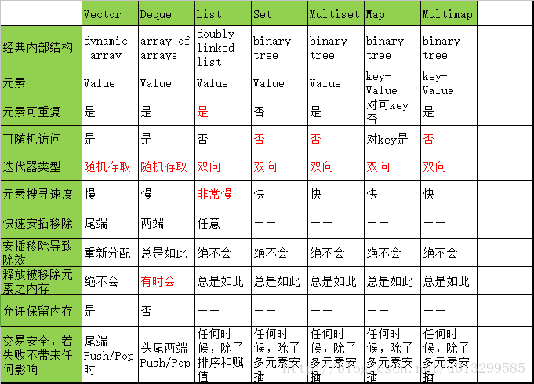

简单介绍

本人目前在学习C++中的STL，主要是看网上的资料进行学习，为了方面之后的查阅，在此做一个总结。

---

## STL介绍

STL中常见容器，主要包括如下几种：  
vector，list，deque，set，multiset，map，multimap。  
选用合适的容器，对编写高效的程序，简洁的代码有重要意义;   
首先一个表格整理了各个容器的一些特性，具体应用时可以根据特性进行筛选。

`具体选择时机：`
* vector：简单，允许随机存储，数据的存取十分灵活，在缺省情况下应该使用。
* deque：经常在头部和尾部安插和移除元素，并且存储的容量也比vector大得多。
* list：如果经常在容器的中段执行安插，移除和移动元素。但是不支持随机存储。
* set和multiset：经常以某个准则寻找元素，可以使用“以这个准则为排序准则”的set和multiset，在大量的数据情况下，对数复杂度比线性复杂度的效果要好的多。
* map和multimap：使用（key、value）的pair，使用字典，使用关联式数组 e.g“map[key] = value”。
* list容器中尽量不要使用删除操作，比插入操作多消耗近百倍

`参考链接: `   
[STL使用分类](https://blog.csdn.net/u013299585/article/details/78323973)  
[STL学习网址](http://c.biancheng.net/stl/)
